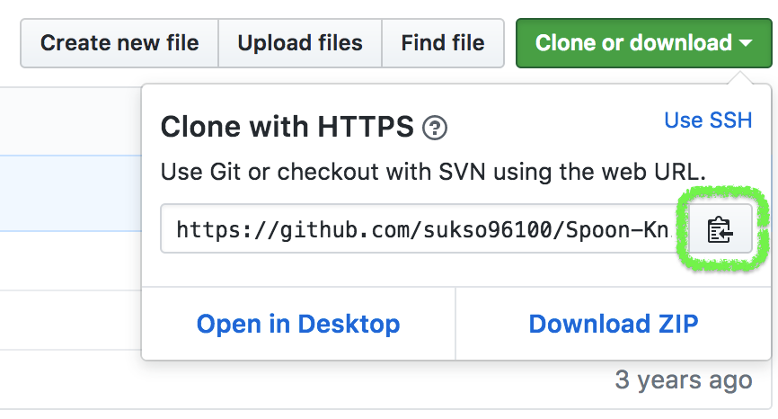
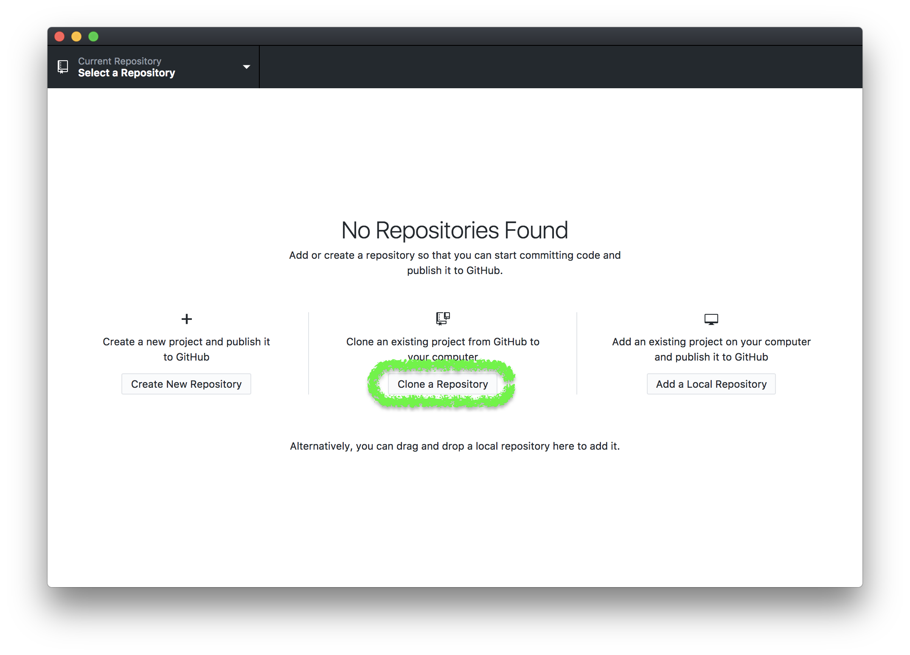
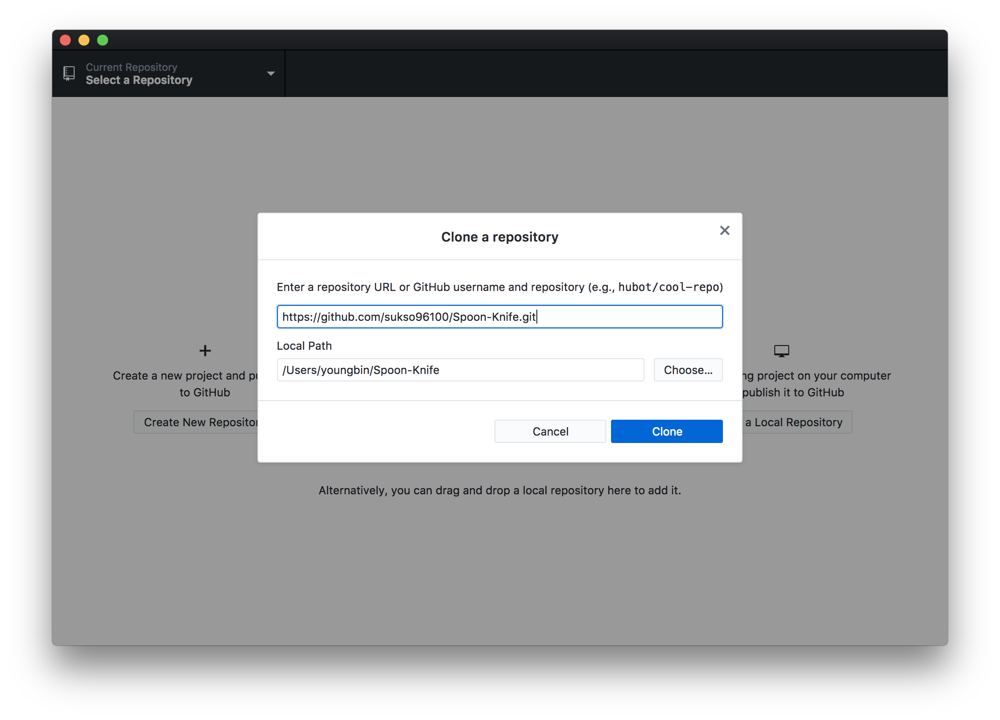

Spoon-Knife 저장소를 성공적으로 fork 하셨습니다. 그러나 지금까지, GitHub 에만 있을 뿐입니다.
프로젝트에서 작업하려면, 여러분의 컴퓨터로 복제해야 합니다.

데스크탑용 GitHub 앱을 사용 하신다면, 이 과정은 아주 쉽습니다.
여러분의 Spoon-Knife 의 fork 에서, **Clone or Download** 를 누르면 나타나는 팝업에서 URL 을 복사한 다음 데스크탑용 GitHub 를 켭니다.
그리고, **Clone a Repository** 를 누릅니다.
누르면, 어느 저장소를 복제할 건지, 어디에 저장하고 싶은지 물어볼 것입니다.
첫 번째 칸에 복사한 URL을 붙여넣고, 두 번쨰 칸에서 여러분들이 컴퓨터에서 파일과 폴더를 만들기 편한 위치를 선택하세요.
   
   
   
