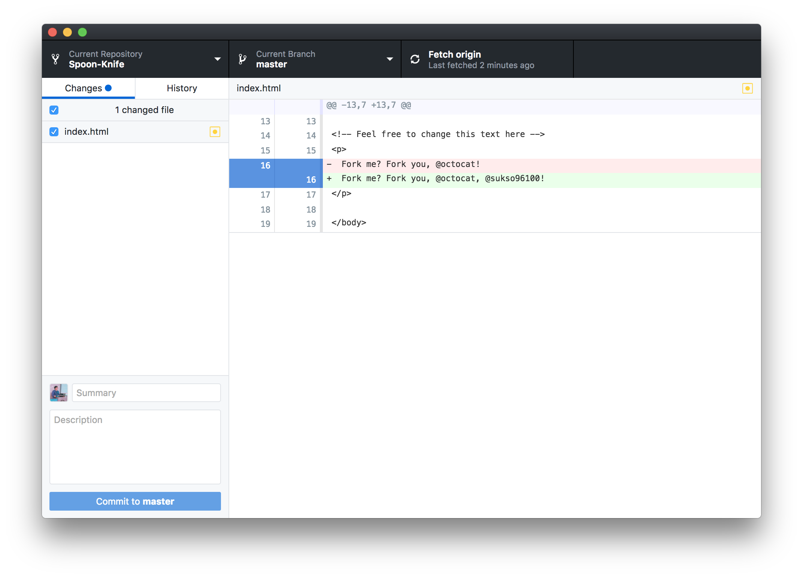

[Atom](https://atom.io) 같은 여러분들이 선호하는 텍스트 편집기로 프로젝트에 몇가지 변경사항을 만들어 보세요.
예를 들어, *index.html* 을 수정하여 여러분의 GitHub Username을 추가할 수 있습니다.

변경사항을 제출할 준비가 되었다면, 데스크탑용 GitHub 에서 *커밋 요약(commit summary)* 을 입력하고, **Commit** 을 누르세요.
   

지금은, "좋아, 내가 내 변경사항에 대한 스냅샷을 찍었어!" 라고 Git 에게 필수적으로 알려줘야 합니다. 계속해서 더 많은 변경사항을 만들 수 있습니다. 그리고 더 많은 커밋 스냅샷을 잡을 수 있습니다. GitHub.com 에 변경사항을 푸시할 준비가 되었다면, **Sync** 버튼을 누르세요. 여러분의 변경사항 목록 바로 위에 있습니다.
