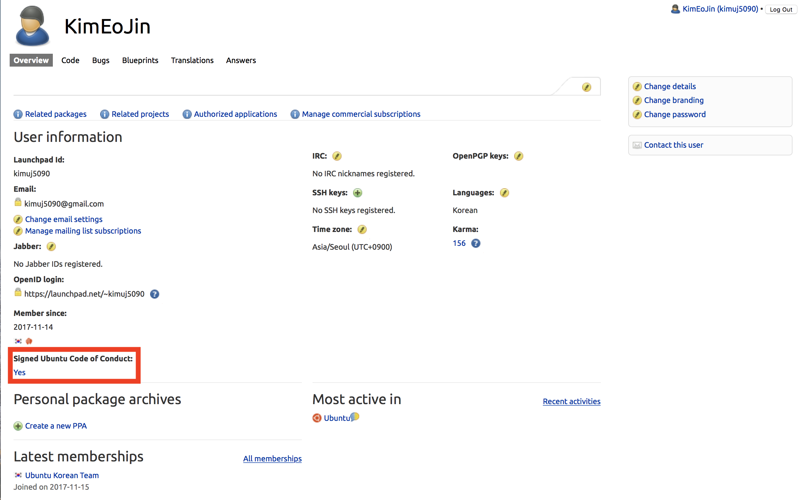
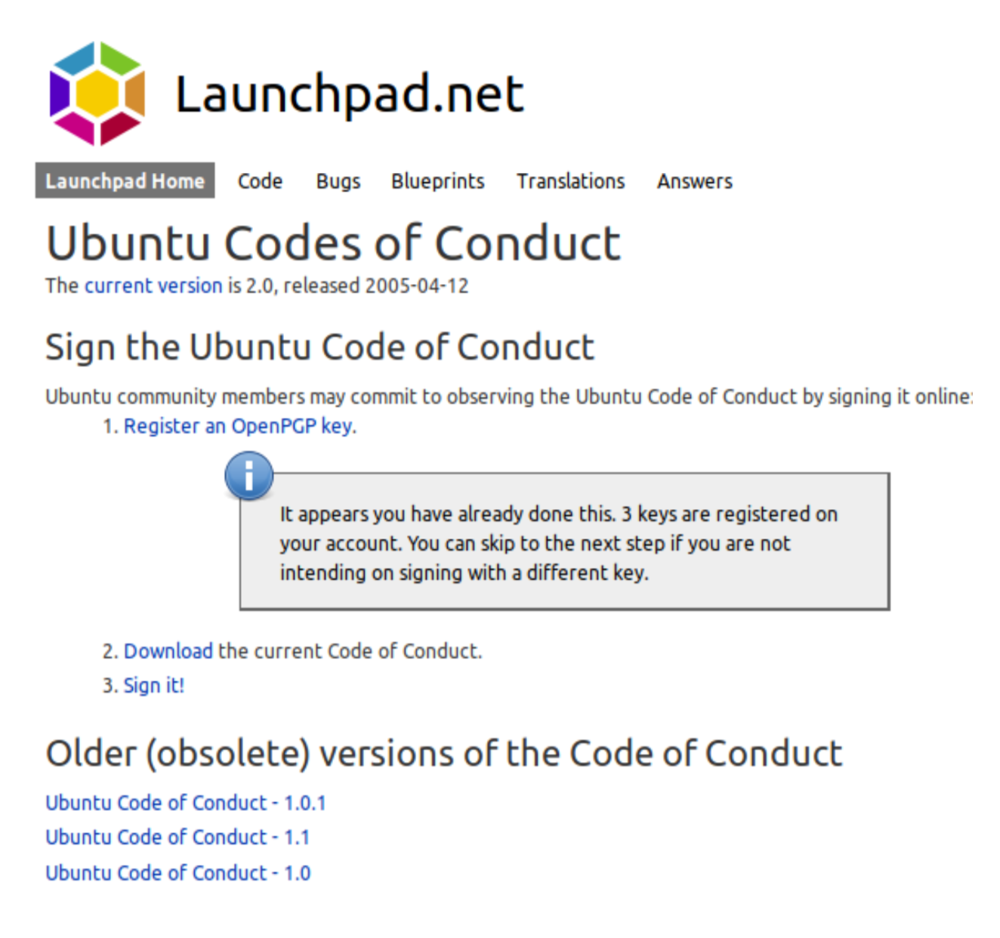
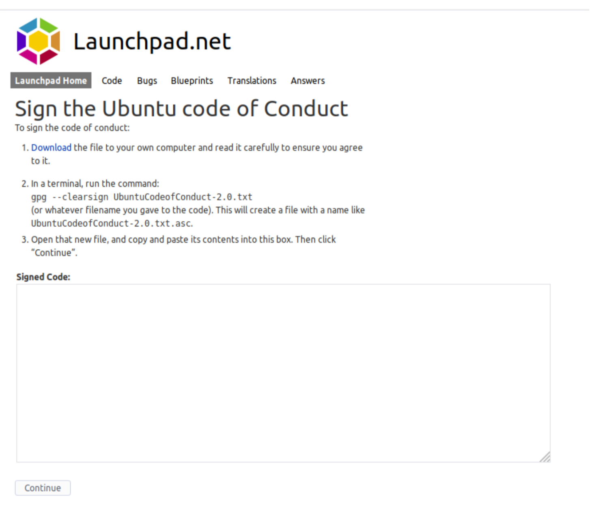

1. [Ubuntu Code of Conduct](https://launchpad.net/codeofconduct/2.0/+download)를 다운받습니다.
1. 한국어 번역본은 [이곳](https://wiki.ubuntu-kr.org/index.php/Ubuntu-code-of-conduct)에 있습니다.
1. 다운로드된 디렉토리로 들어가 다음과 같이 입력하여 나온 내영을 복사합니다.

> gpg --clearsign UbuntuCodeofConduct-2.0.txt
> cat UbuntuCodeofConduct

1. 다시 프로필 화면으로 들어갑니다.
1. 아래 표시된 부분의 No를 클릭합니다. (이미지상의 Yes)

1. 아래 표시된 sign it을 누릅니다.

1. sign code에 복사한 내용을 붙여넣습니다.
1. continue를 클릭합니다.

런치패드에 가입을 완료했습니다.
